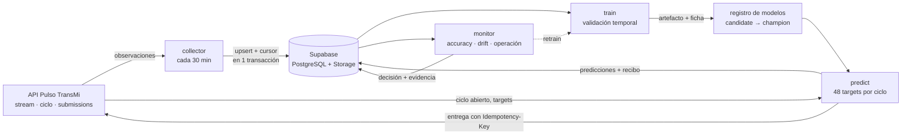

# Pulso TransMi · sistema MLOps

Sistema que pronostica la demanda de pasajeros de 12 estaciones de TransMilenio a +15, +30, +45 y
+60 minutos y **opera** ese pronóstico en el tiempo: recolecta datos nuevos, entrena y versiona
modelos, predice y envía cada ciclo, mide su propio error y decide cuándo reentrenar.

Proyecto del curso MLOps (Universidad Externado de Colombia). Contrato de la API:
[uexternadojz/pulso-transmi](https://github.com/uexternadojz/pulso-transmi) ·
API: <https://pulso-transmi.72-60-245-2.sslip.io/docs>

## Arquitectura



| Capa | Dónde vive | Qué garantiza |
|---|---|---|
| Datos | Supabase (`observations`, `context`, `stations`) | Llave `(station_id, observed_at)`: repetir una carga no duplica |
| Collector | `src/pulso/ingest.py` + función SQL `ingest_observations` | El cursor solo avanza si el lote se confirmó (misma transacción) |
| Modelos | `model_versions` + bucket privado `models` | Versión, corte de datos, commit, features, validación y hash; un solo champion |
| Inferencia | `src/pulso/predict.py` | Solo datos ≤ `data_cutoff`; exactamente los targets del ciclo; evidencia antes de enviar |
| Monitoreo | `src/pulso/monitor_job.py` | Accuracy móvil y acumulada, drift, salud operacional y decisión registrada |
| Automatización | GitHub Actions (`.github/workflows/`) | Repetible y observable; el estado vive en la base, no en el runner |

## Resultados

Validación **temporal** (3 semanas consecutivas, orígenes cada hora, métrica oficial
`100 × max(0, 1 − WAPE)` por estación y promediada):

| Modelo | Accuracy medio |
|---|---|
| **`gbm_residual` (champion)** | **87,59 %** |
| `ridge_residual` (perfil + corrección lineal) | 87,27 % |
| `profile_only` (perfil estacional puro) | 86,78 % |
| mismo instante de la semana pasada | 83,25 % |
| repetir el último valor | 74,42 % |

La demanda es casi puro calendario: el perfil «estación × hora de la semana» explica el 96 % de la
varianza y ya roza el techo estimado (~88 %). El modelo aporta +0,8 pts y, sobre todo, **robustez
ante cambios**: en pruebas de estrés con drift sintético amortigua cambios de nivel y tendencia, y
reentrenar con solo 2 días de datos nuevos recupera la mayor parte de un cambio de patrón.

Detalle y límites honestos: [`reports/eda.md`](reports/eda.md) ·
[`reports/backtest.md`](reports/backtest.md) · [`reports/drift_stress.md`](reports/drift_stress.md)

## Decisiones de diseño

1. **Perfil estacional + corrección** en lugar de un modelo genérico sobre series: el calendario
   domina, así que el modelo predice la desviación logarítmica respecto al perfil, con pérdida L1
   (que es lo que mide el WAPE).
2. **Leave-one-out en el perfil**: ningún instante forma parte de su propio perfil; el residuo que ve
   el modelo al entrenar se parece al que verá al predecir.
3. **Sin fuga del futuro, probada**: las pruebas perturban todo lo posterior al origen y exigen que
   variables y predicciones no cambien.
4. **Sin `context` (clima/eventos)**: la API solo lo publica en el corte estático; el modelo no
   debe depender de algo que no tendrá al predecir.
5. **Promoción con evidencia**: un candidato debe superar al perfil puro y al champion por ≥ 0,2 pts
   en la misma ventana; la novedad por sí sola no cuenta. `promote_model` en SQL permite rollback.
6. **Reentrenar con criterio** (`src/pulso/policy.py`): persistencia (no un solo periodo difícil),
   datos nuevos suficientes, enfriamiento, y **primero se corrige la operación** antes de culpar al
   modelo. Los umbrales se calibraron con el estrés de drift (y una falsa alarma real llevó a umbrales
   de nivel propios de cada estación).
7. **Fallar a la vista**: cualquier error relanza la excepción y el workflow falla; además queda
   registrado en `pipeline_runs`/`ingestion_runs`.
8. **Seguridad**: RLS activado sin políticas y sin permisos para `anon`/`authenticated`; solo la
   service role (Secrets de Actions) escribe. Ninguna clave se imprime ni se guarda en la base.

## Estructura

```text
src/pulso/       api · supa · ingest · features · model · baselines · backtest · registry
                 train · predict · monitor · monitor_job · policy · stress · quality
supabase/migrations/   esquema SQL reproducible (0001-0003)
scripts/         eda.py · run_backtests.py · drift_stress.py · practice_submit.py
reports/         análisis exploratorio, backtesting y estrés de drift (con figuras)
tests/            pruebas (sin red: API y Supabase simulados)
.github/workflows/  ci · collect-and-predict · collect-and-monitor · train
docs/runbook.md  puesta en marcha, operación y diagnóstico
```

## Puesta en marcha

Ver [`docs/runbook.md`](docs/runbook.md). En resumen: variables en `.env` (plantilla en
`.env.example`), Secrets del repositorio (`PULSO_API_KEY`, `SUPABASE_URL`,
`SUPABASE_SERVICE_ROLE_KEY`), ejecutar **una vez** el workflow «Entrenar candidato» para crear el
champion inicial y definir la variable `PIPELINE_ENABLED=true` para activar los horarios.

```bash
python -m venv .venv && source .venv/bin/activate
python -m pip install -r requirements.txt && python -m pip install -e '.[eda,dev]'
pytest                                   #  pruebas, sin red
python scripts/eda.py                    # regenera reports/eda.md
python scripts/run_backtests.py          # regenera reports/backtest.md (varios minutos)
python scripts/drift_stress.py           # regenera reports/drift_stress.md
python scripts/practice_submit.py        # simulacro de entrega; --send para enviar
```

Los datos iniciales (`data/*.csv`) no se versionan: se descargan de la API
(`/v1/downloads/*`) y la fuente de verdad es Supabase.

## Qué falta / límites

- El `context` no se usa; si la API lo libera durante la competencia sería la mejora principal.
- Los drifts de estrés son propios y simples; los umbrales deben revisarse con los primeros ciclos reales.
- Dashboard en Vercel, MLflow y el monitoreo de data drift más allá del nivel: bonos, no implementados.
- El comportamiento del cursor del stream (`next_cursor`) con datos reales no se pudo comprobar
  (el reloj sigue en `waiting`); el collector relee la última página y tolera un cursor rechazado.

## Licencia

MIT
