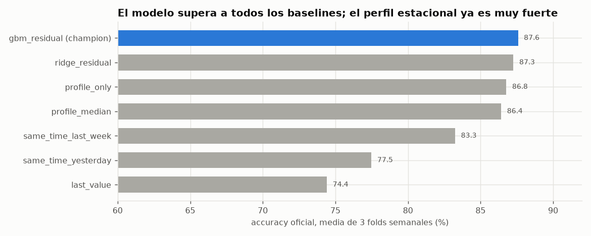

# Backtesting temporal — baselines, modelo y sensibilidad

> Generado por `scripts/run_backtests.py`. Validación **temporal**: cada fold entrena con datos
> anteriores a su ventana y se evalúa en la semana siguiente. Nunca hay particiones aleatorias.

## Protocolo

| Fold | Entrena hasta (inclusive) | Valida (7 días) |
|---|---|---|
| fold1 | 2026-08-18 | 2026-08-19 → 2026-08-25 |
| fold2 | 2026-08-25 | 2026-08-26 → 2026-09-01 |
| fold3 | 2026-09-01 | 2026-09-02 → 2026-09-08 |

- **Orígenes de validación:** cada hora en punto (como los ciclos reales), con los 4 horizontes
  (+15, +30, +45, +60 min) dentro de la ventana: 8016 targets por fold.
- **Métrica:** accuracy oficial = promedio no ponderado por estación de `100 × max(0, 1 − WAPE)`.
- **Causalidad:** las variables solo usan datos ≤ origen (probado en `tests/test_features.py` con
  perturbaciones del futuro). El modelo queda congelado durante cada ventana de validación.
- El fold 3 coincide con la partición sugerida en la guía (38 días de entrenamiento, 7 de validación).

## 1. Modelo frente a baselines

| modelo | fold1 | fold2 | fold3 | media |
|---|---|---|---|---|
| gbm_residual (champion) | 87.57 | 87.25 | 87.94 | 87.59 |
| ridge_residual | 87.12 | 87.02 | 87.66 | 87.27 |
| profile_only | 86.79 | 86.34 | 87.20 | 86.78 |
| profile_median | 86.40 | 86.04 | 86.83 | 86.42 |
| same_time_last_week | 83.61 | 83.03 | 83.12 | 83.25 |
| same_time_yesterday | 77.78 | 76.81 | 77.87 | 77.49 |
| last_value | 74.24 | 74.46 | 74.56 | 74.42 |

- El modelo gana **+0.81 pts** sobre el perfil estacional puro, **+0.32 pts** sobre el
  mejor baseline (`ridge_residual`, perfil + corrección lineal) y **+13.2 pts** sobre repetir
  el último valor. Un baseline «ingenuo» pierde mucho porque la demanda es casi puro calendario.
- El perfil `profile_only` ya alcanza 86.8 %, cerca del techo estimado
  (≈ 88 %, ver H2 en `eda.md`). Sobre ese techo solo queda espacio para la corrección reciente, y
  por eso la mejora del modelo es pequeña pero consistente en los tres folds.
- Repetir «lo mismo de la semana pasada» (83.3 %) pierde ~4 pts
  frente al perfil: una sola semana arrastra todo su ruido.

## 2. Error por horizonte y por estación (modelo)

| modelo | fold1 | fold2 | fold3 | media |
|---|---|---|---|---|
| +15 min | 87.54 | 87.58 | 87.89 | 87.67 |
| +30 min | 87.56 | 87.23 | 88.17 | 87.65 |
| +45 min | 87.84 | 86.78 | 87.96 | 87.53 |
| +60 min | 87.38 | 87.40 | 87.73 | 87.50 |

La exactitud casi no depende del horizonte: la parte predecible (calendario) no se degrada de
+15 a +60 min, y los rezagos recientes aportan poco.

| modelo | fold1 | fold2 | fold3 | media | vs profile_only |
|---|---|---|---|---|---|
| 02300 Calle 100 - Marketmedios | 86.90 | 86.46 | 85.98 | 86.45 | 0.78 |
| 10009 Museo Nacional | 86.24 | 86.16 | 86.96 | 86.45 | 1.63 |
| 07105 Movistar Arena | 86.58 | 86.39 | 87.79 | 86.92 | 1.46 |
| 09000 Portal Usme | 87.52 | 86.45 | 87.59 | 87.19 | 0.64 |
| 06000 Portal El Dorado – C.C. NUESTRO BOGOTÁ | 87.82 | 86.40 | 87.49 | 87.24 | 0.64 |
| 06111 Universidades – CityU | 87.36 | 86.77 | 87.94 | 87.36 | 0.67 |
| 07107 Universidad Nacional | 87.90 | 87.41 | 88.48 | 87.93 | 0.90 |
| 09122 Calle 72 | 87.97 | 87.75 | 88.43 | 88.05 | 0.41 |
| 05000 Portal Américas | 87.37 | 88.09 | 89.12 | 88.19 | 0.46 |
| 03000 Portal Suba | 88.64 | 87.81 | 88.37 | 88.27 | 0.67 |
| 07111 Ricaurte - NQS | 88.60 | 88.29 | 88.03 | 88.31 | 0.70 |
| 05100 Banderas | 87.99 | 88.96 | 89.10 | 88.68 | 0.74 |

La columna `vs profile_only` es la mejora sobre el perfil puro en cada estación. Las estaciones de
menor accuracy son las de más ruido relativo; pesan igual que las demás en la métrica.

## 3. Qué aporta cada grupo de variables (ablación)

| modelo | fold1 | fold2 | fold3 | media |
|---|---|---|---|---|
| todas las variables | 87.57 | 87.25 | 87.94 | 87.59 |
| sin variables recientes (solo calendario + perfil) | 87.36 | 86.71 | 87.44 | 87.17 |
| sin factor ciudad (c0, c4) | 87.47 | 87.11 | 87.74 | 87.44 |
| sin forma del perfil (p_origin, p_delta) | 87.29 | 87.06 | 87.82 | 87.39 |
| sin medias largas (m16, m96) | 87.60 | 87.27 | 87.95 | 87.61 |

Las variables recientes (residuos y medias móviles) suman ≈ 0.4 pts en
histórico estable. Su valor real aparece con drift (ver `drift_stress.md`): el modelo con estas
variables aguanta un cambio de nivel mucho mejor que el perfil puro.

## 4. Sensibilidad a hiperparámetros

| modelo | fold1 | fold2 | fold3 | media |
|---|---|---|---|---|
| por defecto (250 iter, 15 hojas) | 87.57 | 87.25 | 87.94 | 87.59 |
| 120 iteraciones | 87.48 | 87.14 | 87.88 | 87.50 |
| 500 iteraciones, lr 0.03 | 87.57 | 87.25 | 87.91 | 87.58 |
| 31 hojas, min 200 por hoja | 87.65 | 87.32 | 87.98 | 87.65 |
| 7 hojas | 87.43 | 87.18 | 87.86 | 87.49 |
| perfil con vida media 21 d | 87.58 | 87.25 | 87.88 | 87.57 |
| perfil con vida media 10 d | 87.53 | 87.17 | 87.70 | 87.47 |

Todas las variantes quedan dentro de 0.19 pts entre sí: el modelo está en una meseta y no
conviene sobreajustar tres folds. Se conserva la configuración por defecto. Dar más peso a las semanas
recientes (vida media del perfil de 21 o 10 días) **no mejora** el histórico estable (−0,02 y −0,12 pts):
hay menos muestras efectivas por celda de la semana, y la varianza compensa cualquier sesgo evitado.

## 5. Decisión

**Champion inicial:** `gbm_residual` con la configuración por defecto: accuracy medio
87.59 % en validación temporal: +0.81 pts sobre `profile_only` y +0.32 pts
sobre `ridge_residual`, el baseline más fuerte.
La promoción exige superar al `profile_only` y a cualquier champion previo por al menos 0,2 pts
(`policy.py`); una novedad por sí sola no cuenta como mejora.

**Límites honestos:**
- El histórico no tiene drift, así que estos folds no miden robustez: eso lo cubre `drift_stress.md`.
- No se usa `context` (clima/eventos): la API lo publica solo en el corte estático. Si se libera durante
  la competencia, sería la principal mejora pendiente (la lluvia explica una parte del residuo de ciudad).
- Tres folds de una semana dan una incertidumbre de ≈ ±0,3 pts; diferencias menores no son concluyentes.
