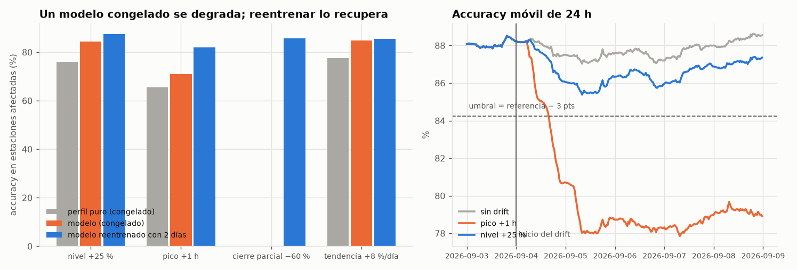

# Prueba de estrés con drift sintético

> Generado por `scripts/drift_stress.py`. El histórico oficial no tiene drift; aquí se **simula**
> (`src/pulso/stress.py`) imitando los tipos publicados: `level_shift`, `peak_shift`,
> `closure` y `trend_change`. Son escenarios propios, no los de la competencia.

**Montaje:** champion congelado (entrenado hasta 2026-09-01), drift desde 2026-09-04 00:00
con transición gradual de 12 h, y evaluación hasta 2026-09-08. Referencia de validación del
champion: **87.25 %** (accuracy de la semana previa, no la evaluada).

## 1. ¿Cuánto se degrada un modelo congelado?

Accuracy desde 09-04 12:00 (rampa completada). `acc_afectadas` = solo las estaciones con drift.

| escenario | modelo | acc_total | acc_afectadas |
|---|---|---|---|
| sin drift | profile_only | 86.87 | — |
| sin drift | ridge_residual | 87.52 | — |
| sin drift | gbm_residual | 87.84 | — |
| nivel +25 % (4 estaciones) | profile_only | 83.39 | 76.11 |
| nivel +25 % (4 estaciones) | ridge_residual | 85.86 | 82.58 |
| nivel +25 % (4 estaciones) | gbm_residual | 86.60 | 84.44 |
| pico +1 h (todas las de grupo B) | profile_only | 75.85 | 65.49 |
| pico +1 h (todas las de grupo B) | ridge_residual | 79.33 | 73.62 |
| pico +1 h (todas las de grupo B) | gbm_residual | 78.85 | 70.91 |
| cierre parcial −60 % (1 estación) | profile_only | 79.54 | 0.00 |
| cierre parcial −60 % (1 estación) | ridge_residual | 80.15 | 5.61 |
| cierre parcial −60 % (1 estación) | gbm_residual | 80.01 | 0.00 |
| tendencia +8 %/día (3 estaciones) | profile_only | 84.50 | 77.60 |
| tendencia +8 %/día (3 estaciones) | ridge_residual | 86.27 | 82.93 |
| tendencia +8 %/día (3 estaciones) | gbm_residual | 86.89 | 84.82 |

- El modelo con variables recientes **amortigua** los cambios de nivel y de tendencia mucho mejor que
  el perfil puro (compárense `gbm_residual` y `profile_only` en las estaciones afectadas).
- Un **cambio de pico** o un **cierre** rompen cualquier modelo congelado: el patrón aprendido ya no existe.
  En el cierre, la accuracy de la estación afectada llega a ~0 (WAPE > 1: se predice mucho más de lo real).

## 2. ¿Reentrenar lo recupera?

Reentrenar con los datos hasta 09-05 (2 días con drift) y evaluar desde 09-06:

| escenario | congelado | reentrenado | congelado_afectadas | reentrenado_afectadas |
|---|---|---|---|---|
| sin drift | 88.03 | 88.01 | — | — |
| nivel +25 % (4 estaciones) | 86.88 | 87.80 | 84.85 | 87.41 |
| pico +1 h (todas las de grupo B) | 78.80 | 84.56 | 70.53 | 81.89 |
| cierre parcial −60 % (1 estación) | 80.23 | 87.48 | 0.00 | 85.81 |
| tendencia +8 %/día (3 estaciones) | 86.85 | 87.20 | 84.21 | 85.49 |

Con solo 2 días de datos nuevos el reentrenamiento recupera casi todo en nivel, tendencia y cierre.
El cambio de pico se recupera parcialmente: el perfil semanal mezcla 5 semanas del patrón viejo con
2 días del nuevo; mejora conforme llegan más días (reentrenamientos programados diarios).

**Descartado:** dar más peso a lo reciente (vida media de 5 días) empeoró tanto con drift como sin él
en las pruebas exploratorias: con pocas muestras por celda semanal, la varianza pesa más que el sesgo.

## 3. ¿Las reglas de monitoreo lo detectan?

Reglas (`policy.RetrainRules`): señal de **desempeño** = accuracy móvil 24 h por debajo de
referencia − 3 pts durante 4 evaluaciones seguidas (cada 30 min);
señal de **datos** = |desplazamiento de nivel de 24 h| ≥ umbral propio de la estación durante
12 evaluaciones seguidas (6 h). El umbral es `max(0.1, 1.25 × ruido de fondo de la estación)`,
donde el ruido de fondo es el mayor desplazamiento de 24 h visto en el entrenamiento (eventos, lluvia).
Las horas se cuentan desde el inicio del drift.

Umbrales por estación: 02300 0.14, 03000 0.12, 05000 0.11, 05100 0.11, 06000 0.11, 06111 0.14, 07105 0.23, 07107 0.17, 07111 0.14, 09000 0.18, 09122 0.11, 10009 0.18.

| escenario | acc_rolling_min | max_|desplaz| | max_desplaz/umbral | señal_desempeño_h | señal_datos_h | reentrenar_h |
|---|---|---|---|---|---|---|
| sin drift | 87.03 | 0.13 | 0.75 | — | — | — |
| nivel +25 % (4 estaciones) | 85.38 | 0.33 | 2.47 | — | 20.50 | 20.50 |
| pico +1 h (todas las de grupo B) | 77.85 | 0.14 | 1.13 | 17.50 | — | 17.50 |
| cierre parcial −60 % (1 estación) | 79.13 | 0.91 | 6.56 | 19.50 | 16.00 | 16.00 |
| tendencia +8 %/día (3 estaciones) | 86.45 | 0.35 | 3.33 | — | 35.50 | 35.50 |

- **Falsas alarmas:** en el escenario sin drift, el accuracy móvil mínimo fue 87.03 % (umbral
  84.25) y el desplazamiento de nivel máximo llegó al 75 % de su umbral.
  Ninguna señal se disparó.
- **Lección de la calibración:** con un umbral fijo de 0.10 y persistencia de 2 h, un evento de tarde-noche
  (+23 % en Museo Nacional y Movistar Arena) disparó una falsa alarma a las 24 h. Por eso el umbral pasó a
  ser propio de cada estación (las sensibles a eventos tienen más ruido) y la persistencia del nivel a 6 h.
  Sigue siendo una calibración con 5 eventos históricos: un evento mayor podría disparar una alarma, cuyo
  costo es bajo (un reentrenamiento que la regla de promoción rechaza si no mejora).
- Las dos señales se **complementan**: el cambio de nivel y la tendencia casi no mueven el accuracy
  total (afectan a pocas estaciones) pero sí el desplazamiento de nivel; el cambio de pico no mueve el
  nivel medio (sube y baja) pero sí hunde el accuracy.
- «reentrenar_h» es cuándo `decide_retrain` decidiría reentrenar (tras persistencia, con ≥ 12 h de
  datos nuevos y fuera del enfriamiento de 6 h).

## 4. Conclusiones

1. Un modelo estático **no basta**: pico y cierre lo rompen; hace falta reentrenar.
2. Reentrenar con datos recientes es la respuesta correcta y funciona con pocos días.
3. La política combina persistencia, volumen de datos nuevos y enfriamiento para no reaccionar a un
   único periodo difícil, y prioriza arreglar fallas operacionales antes de reentrenar.
4. **Límite:** estos drifts son propios y simples. Los de la competencia (con `weather_change`,
   `variance_shift`, redistribución espacial en cierres) pueden comportarse distinto; los umbrales
   deben revisarse con los datos reales de los primeros ciclos.
