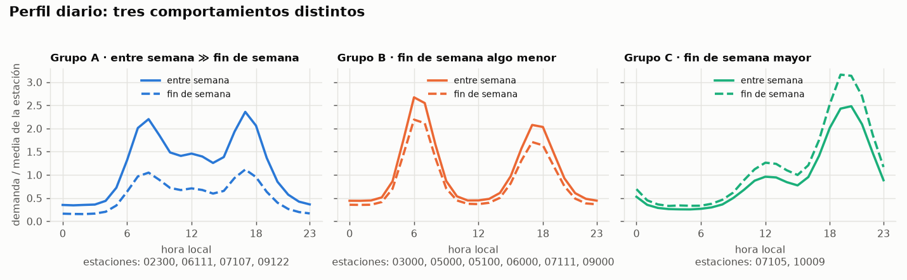
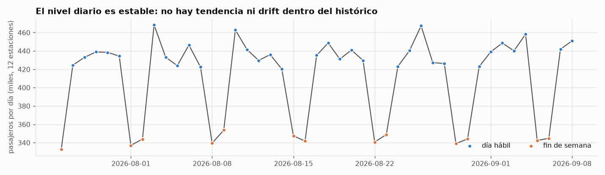
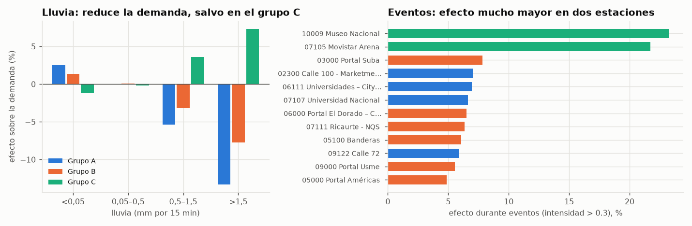
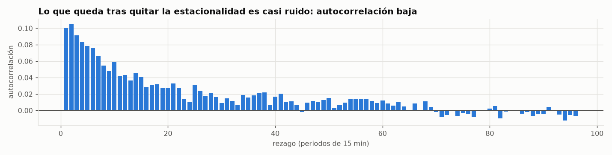

# Análisis exploratorio — Pulso TransMi

> Generado por `scripts/eda.py` a partir del corte inicial oficial. Todas las cifras
> se recalculan al ejecutarlo.

## 1. Calidad de los datos

| Control | Resultado |
|---|---|
| Observaciones | 51,840 (12 estaciones × 4,320 periodos) |
| Rango (hora local, UTC-5) | 2026-07-26 00:00 → 2026-09-08 23:45 |
| Periodos faltantes en la rejilla de 15 min | 0 |
| Duplicados `(station_id, observed_at)` | 0 |
| Valores nulos / demanda negativa / fuera de rejilla | 0 / 0 / 0 |
| Contexto: filas, duplicados, nulos | 4,320, 0, 0 |
| Demanda mínima / mediana / máxima | 14 / 263 / 2284 |
| Ceros | 0 |

**Conclusión:** el histórico es completo y consistente (sin ningún problema).
No hace falta imputar ni filtrar. Los IDs de estación son texto de 5 dígitos y se conservan como tal.

## 2. Variable objetivo y diccionario de datos

**Objetivo:** `demand` (pasajeros por estación y periodo de 15 min) en cuatro horizontes
futuros: +15, +30, +45 y +60 min desde el `data_cutoff` del ciclo.

| Campo | Tipo | Descripción |
|---|---|---|
| `station_id` | texto (5 dígitos) | Estación; conservar los ceros iniciales |
| `observed_at` | timestamptz | Inicio del periodo de 15 min; la API lo entrega en UTC-5 |
| `demand` | entero ≥ 0 | Pasajeros del periodo (conteo, binomial negativa según el generador) |
| `rain_mm`, `rain_forecast` | real | Lluvia observada y pronóstico |
| `temperature_c`, `temperature_forecast` | real | Temperatura observada y pronóstico |
| `event_intensity` | real [0, 1] | Intensidad de eventos masivos (curva suave alrededor del evento) |

## 3. Estacionalidad: domina todo

El perfil «estación × hora de la semana» (672 valores por estación) explica el
**96.3 %** de la varianza de `log(demanda)` dentro de cada estación.
El ruido restante tiene una desviación de 0.147 en escala logarítmica (≈ 15 %).

Las 12 estaciones se separan en tres comportamientos según la razón demanda de fin de
semana / entre semana:

- **Grupo A** (razón ≈ 0.48): 02300, 06111, 07107, 09122. Demanda laboral/universitaria: cae a la mitad el fin de semana.
- **Grupo B** (razón ≈ 0.82): 03000, 05000, 05100, 06000, 07111, 09000. Residencial/intercambio: picos de ida y vuelta.
- **Grupo C** (razón ≈ 1.28): 07105, 10009. Ocio: sube el fin de semana y de noche.

| station_id | estación | grupo | media | máx | hora pico (hábil) | fin sem./sem. |
|---|---|---|---|---|---|---|
| 02300 | Calle 100 - Marketmedios | A | 294 | 1472 | 17:00 | 0.48 |
| 03000 | Portal Suba | B | 258 | 1252 | 07:00 | 0.82 |
| 05000 | Portal Américas | B | 342 | 1944 | 06:00 | 0.81 |
| 05100 | Banderas | B | 591 | 2065 | 07:00 | 0.82 |
| 06000 | Portal El Dorado – C.C. NUESTRO BOGOTÁ | B | 511 | 1789 | 18:00 | 0.82 |
| 06111 | Universidades – CityU | A | 239 | 835 | 13:00 | 0.47 |
| 07105 | Movistar Arena | C | 273 | 1313 | 19:00 | 1.28 |
| 07107 | Universidad Nacional | A | 281 | 982 | 12:00 | 0.48 |
| 07111 | Ricaurte - NQS | B | 684 | 2284 | 17:00 | 0.82 |
| 09000 | Portal Usme | B | 218 | 1071 | 06:00 | 0.83 |
| 09122 | Calle 72 | A | 250 | 1249 | 17:00 | 0.48 |
| 10009 | Museo Nacional | C | 338 | 1434 | 20:00 | 1.28 |

Los grupos son una inferencia a partir de los datos; los arquetipos reales del generador son privados.

## 4. Nivel y tendencia

Entre la primera y la última semana el promedio cambia +1.7 %, sin tendencia
apreciable. **No hay drift dentro del histórico**: cualquier degradación que aparezca en la
competencia será un cambio nuevo, no algo que el modelo pueda aprender de estos 45 días.

## 5. Clima y eventos

- La lluvia observada y su pronóstico están muy correlacionados (r = 0.82); en temperatura, r = 0.98.
- La lluvia reduce la demanda en los grupos A y B (hasta -13 % con lluvia fuerte)
  y la aumenta en el grupo C (+7 %). A escala ciudad, la correlación del residuo con la lluvia es -0.33.
- La temperatura no tiene efecto detectable (r = -0.00 con el residuo de ciudad).
- Hay 5 eventos en el histórico (tarde-noche, en días distintos). Elevan la demanda
  +7 % en la mediana de estaciones y +23 % en la más afectada.

## 6. Estructura del ruido

- Autocorrelación del residuo: 0.10 (rezago 1), 0.08 (rezago 4), -0.01 (rezago 96).
- Correlación media entre estaciones del mismo instante: 0.08 (factor de ciudad débil).
- Sobredispersión: varianza/media ≈ 4.9 por celda (estación × hora de la semana);
  coeficiente de variación ≈ 0.15. Coherente con una binomial negativa.

## 7. Hipótesis (a contrastar con backtesting temporal)

1. **H1 – Calendario domina.** Un perfil por estación y hora de la semana será un baseline muy
   difícil de superar; el aporte de los rezagos recientes será pequeño (autocorrelación del residuo ≈ 0.10).
2. **H2 – Hay un techo de accuracy cercano a 88 %.** Si la variación por celda (CV ≈ 0.15)
   fuera ruido gaussiano puro, el WAPE mínimo sería ≈ 0,8 × CV ≈ 12 % (aproximación; parte de esa
   variación es clima y eventos, así que el techo real puede ser algo mayor). Los modelos deben medirse
   contra ese techo y no contra 100.
3. **H3 – El clima ayuda solo si está disponible al predecir.** Explica una parte real del residuo de
   ciudad, pero `/v1/context` es un corte estático: hay que verificar si la API lo publica durante la
   competencia antes de depender de él. El modelo principal debe funcionar sin contexto.
4. **H4 – La robustez pesa más que la complejidad.** Sin drift en el histórico, un modelo complejo no
   puede demostrar que resiste cambios. Hay que evaluar cómo degradan los modelos ante un cambio de nivel
   o de perfil, y preferir modelos que se reentrenan rápido con datos recientes.
5. **H5 – Métrica por estación.** La accuracy promedia estaciones sin ponderar; las de baja demanda
   (grupo A/B pequeñas) tienen más ruido relativo y pesan igual. Hay que reportar el error por estación.

## 8. Implicaciones para el diseño

- Validación temporal por bloques de ciclos (origen cada 30 min, 4 horizontes), nunca aleatoria.
- Features de calendario (hora de la semana), rezagos recientes y perfil histórico por estación.
- Un modelo por horizonte (o horizonte como variable) porque el peso de los rezagos cambia con h.
- Reentrenar de forma barata y frecuente con ventana deslizante para reaccionar a drift.
